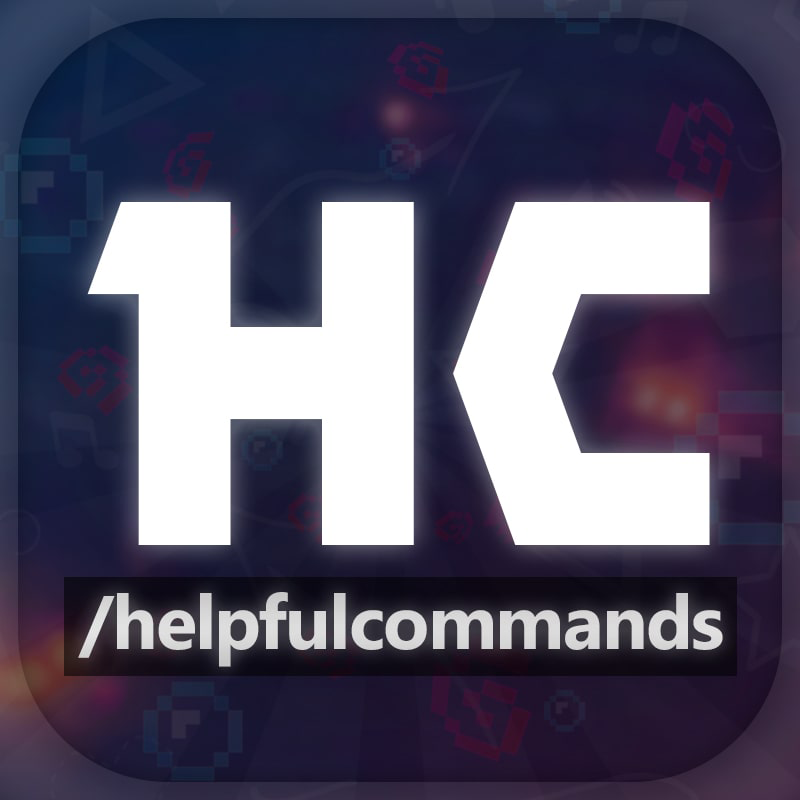

Welcome to the official Helpful Commands Documentation! Here you will find a lot of useful information related to the mod, such as its main features, commands, configuration guide, and more!

## ❓▪ About Mod
<figure style="text-align:left;">
    
    <strong>Helpful Commands</strong> is a feature-rich Minecraft mod that adds lots of useful commands, as well as shortcuts for existing vanilla ones, making your experience better, more optimized, and flexible.
    
It is easy to configure, interactive, and integrates with Permission management tools like <a href="https://luckperms.net/">LuckPerms</a>. You can use it in single player, local multiplayer, and on the server.

</figure>

***

    

    

    

    

***

### ✨▪ Features
* **Lots of new useful commands:** save your time, enhance your experience, and enjoy new features
* **Supports selectors/targets:** use commands on other players and entities
* **Interactive output:** hover over the text to get detailed information, click to perform an action
* **Easily configurable:** each command can be toggled on or off, and you can edit config values in-game
* **Support for Permission management tools:** control who can and can't use certain commands or mod features on your server
* **Purely server-side:** when installed on the server, players won't need to download the mod, and will still be able to use the commands
* **Open Source:** suggest changes, report bugs, and submit your own ideas on GitHub

## 📚▪ Docs nomenclature
### Mod version

    

        
<svg xmlns="http://www.w3.org/2000/svg" viewBox="0 0 24 24"><path d="M5.5 7A1.5 1.5 0 0 1 4 5.5 1.5 1.5 0 0 1 5.5 4 1.5 1.5 0 0 1 7 5.5 1.5 1.5 0 0 1 5.5 7m15.91 4.58-9-9C12.05 2.22 11.55 2 11 2H4c-1.11 0-2 .89-2 2v7c0 .55.22 1.05.59 1.41l8.99 9c.37.36.87.59 1.42.59.55 0 1.05-.23 1.41-.59l7-7c.37-.36.59-.86.59-1.41 0-.56-.23-1.06-.59-1.42Z"></path></svg>

<a href="https://github.com/ThatsNotM3/HelpfulCommands/releases/tag/1.0.1">1.0.0</a>

    

    

        
<svg xmlns="http://www.w3.org/2000/svg" viewBox="0 0 24 24"><path d="M5.5 7A1.5 1.5 0 0 1 4 5.5 1.5 1.5 0 0 1 5.5 4 1.5 1.5 0 0 1 7 5.5 1.5 1.5 0 0 1 5.5 7m15.91 4.58-9-9C12.05 2.22 11.55 2 11 2H4c-1.11 0-2 .89-2 2v7c0 .55.22 1.05.59 1.41l8.99 9c.37.36.87.59 1.42.59.55 0 1.05-.23 1.41-.59l7-7c.37-.36.59-.86.59-1.41 0-.56-.23-1.06-.59-1.42Z"></path></svg>

<a href="https://github.com/ThatsNotM3/HelpfulCommands/releases/tag/1.0.1">1.0.0</a> - <a href="https://github.com/ThatsNotM3/HelpfulCommands/releases/tag/2.0.0">2.0.0</a>

    

It usually represents a mod version that introduced a particular feature or command.

### Permission ID

    

        
<svg xmlns="http://www.w3.org/2000/svg" viewBox="0 0 24 24"><path d="M22 4h-8v3h-4V4H2a2 2 0 0 0-2 2v14a2 2 0 0 0 2 2h20a2 2 0 0 0 2-2V6a2 2 0 0 0-2-2M8 9a2 2 0 0 1 2 2 2 2 0 0 1-2 2 2 2 0 0 1-2-2 2 2 0 0 1 2-2m4 8H4v-1c0-1.33 2.67-2 4-2s4 .67 4 2v1m8 1h-6v-2h6v2m0-4h-6v-2h6v2m0-4h-6V8h6v2m-7-4h-2V2h2v4Z"></path></svg>

helpfulcommands.some.permission.id

    

Specifies the ID of the permission that the player must have in order to use a particular feature or command (for use with permission management tools).