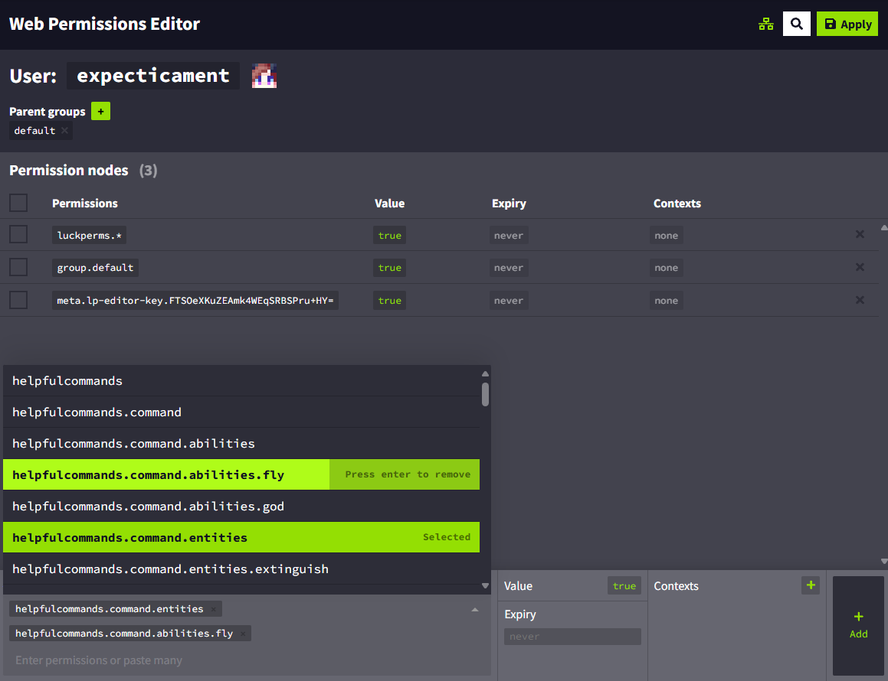

Helpful Commands is also powerful in terms of permission management. You can manage permissions using built-in tools and special commands on internal servers, or even better, use permission management tools like [LuckPerms](https://luckperms.net/) on your dedicated servers.

## 📥▪ Built-in
Good for an integrated server where you don't need flexibility and just want to allow everyone to use certain commands.
### Command permissions
There are 2 types of commands:

- **Public**: everyone can use
- **Restricted (non-public)**: only OPs can use

By default, all commands are **Restricted**. The host can change the public state of any command. Learn how to do this [here](https://expecticament.github.io/HelpfulCommands/configuration/#toggle-commands-public-state).
### Config permissions
You can't use built-in tools to manage configuration permissions. This is because they are meant to be used on integrated servers where only the host can configure the mod, with no exceptions.

## ⚒️▪ Permission management tools
Powerful and flexible control over every aspect of the mod, from commands to configuration. Great for dedicated servers with many players and groups with different permissions.
### Basics
Every single command, including configuration commands, has a unique permission ID that the player must have in order to use it or configure the mod. All IDs can be found in this documentation:

- For basic commands, in [Commands](https://expecticament.github.io/HelpfulCommands/commands/)
- For configuration and configuration commands, in [Configuration](https://expecticament.github.io/HelpfulCommands/configuration/)

Using your permissions management tool, set the values of these IDs to `true` or `false`. You can probably find out how to do this in the tool's documentation.
### Examples
[LuckPerms](https://luckperms.net/) was used in all the examples. We assume that you already have a basic understanding of how to use the tool, so we will skip the setup phase and jump right into permissions management. If that's not the case, please read the tool's documentation or watch some tutorials.
#### Command permissions
:information_source: - The permission ID for basic command looks like this: `helpfulcommands.command.(category).(command name)`
!!! info
    You can manage the entire category or a single command.

In this example, we'll allow the player to use all the commands in the **Players & Entities** category and a `/fly` command.

Let's start with the category. In the LuckPerms web editor we will select our player, and then select the permission ID of the category (in our case its `helpfulcommands.commands.entities`):
<figure markdown="span">
  { width=800 }
</figure>

Great! Now for the `/fly` command. In this case, we won't select the whole **Abilities** category, but the permission ID of the command itself (for the `/fly` command its `helpfulcommands.commands.abilities.fly`):
<figure markdown="span">
  { width=800 }
</figure>
That's all we need. We leave the value at `true`, click the **Add** button and apply the changes. Here's the result in the game:
<figure markdown="span">
  { width=800 }
  <figcaption>As expected, I can only use the commands in the <strong>Players & Entities</strong> category and the <code>/fly</code> command.</figcaption>
</figure>

#### Config permissions
:information_source: - The typical config permission ID looks like this: `helpfulcommands.config.*`

In this example, we'll allow the player to manage commands.

Similar to **Command permissions**, we will find the ID in the LuckPerms web editor (in this case its `helpfulcommands.config.managecommand`):
<figure markdown="span">
  { width=800 }
</figure>

After selecting the permission, we leave the value at `true`, click the **Add** button and apply the changes. That's it! Now I can manage all the commands:
<figure markdown="span">
  { width=800 }
  <figcaption>We can see that I can now toggle commands and make them public or restricted.</figcaption>
</figure>

### Important notes
!!! warning
    Public commands override permissions: if the command is public, it can be used by anyone, regardless of their permissions.
!!! warning
    Players with the `helpfulcommands.config.managecommand` permission will always be able to use all commands, regardless of their command permissions.